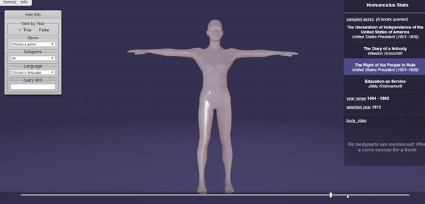
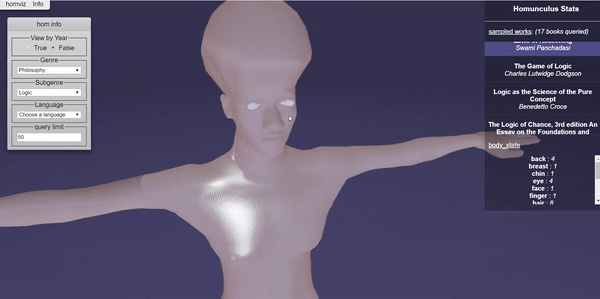

# homviz - The Literary Homunculus
The Homunculus Visualizer, a labor of love and intrigue

Consider for yourself a homunculus. Now consider books. Our team worked to combine these seemingly incompatible concepts in a feat of engineering and artistry.

Overview
-------------------
Homviz takes many books from Project Guttenberg and analyzes frequency of human anatomy, allowing a 3D visualization in the form of what we refer to as **The Literary Homunculus**.

Select a text from the vast Gutenberg corpus and watch with glee as different body parts scale in proportion to their number of mentions. Witness how various body parts dominate in literature across years, genres, and languages, all while being serenaded by beautiful, vintage jazz. **Enjoy.**

Demo
-------------------

Repository Contents
-------------------

* **pullcatalog.sh** - Downloads the catalog from Project Gutenberg, and creates a catalog/ directory with a catalog file for every book. 
* **extractfromcatalog.py** - Goes thorugh every file in the catalog to download the book, parse it, and upload the results to Firebase.
* **/serviceAccountKeys**  - Stores the .json private keys associated with the service account that updates Firebase.
* **/visualize** - Webapp. Luke and Keith do magic here. That is all you need to know.
